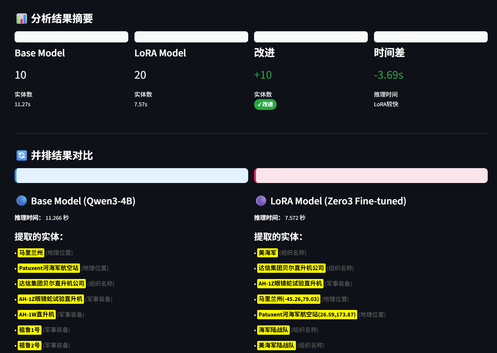

# SFT-ner: Military Named Entity Recognition with LoRA Fine-tuning

[](https://streamlit.io)
[](https://www.python.org/)
[](https://huggingface.co/Qwen)
[](https://arxiv.org/abs/2106.09685)
[](https://www.deepspeed.ai/)

## 🎯 Overview

SFT-ner is a comprehensive Named Entity Recognition (NER) system specifically designed for the military domain. This project demonstrates end-to-end machine learning engineering capabilities, from model fine-tuning to production deployment.

**Live Demo**: http://43.143.128.41:8501


## ✨ Key Features

- **Model Fine-tuning**: Parameter-efficient fine-tuning using LoRA adapter on Qwen3-4B base model
- **Optimization**: Utilizes ZeRO3 memory optimization for efficient training
- **Side-by-Side Comparison**: Interactive web interface to compare base vs. fine-tuned models
- **High-Performance Inference**: Deployed using vLLM for optimized serving
- **Multi-Entity Extraction**: Supports 4 entity types: Military Equipment, Locations, Organizations, Person Names
- **Real-time Visualization**: Plotly-powered charts for performance analysis

## 🛠️ Technology Stack

- **Base Model**: Qwen3-4B (8B parameters)
- **Fine-tuning**: LoRA (Low-Rank Adaptation)
- **Optimization**: ZeRO3 with DeepSpeed
- **Inference Engine**: vLLM
- **Web Framework**: Streamlit
- **Visualization**: Plotly.js
- **Language**: Python 3.12

## 🚀 Quick Start

### Prerequisites

- Python 3.12+
- CUDA-compatible GPU (tested on NVIDIA H20)
- 90GB+ GPU memory for deployment

### Installation

```bash
git clone https://github.com/yourusername/SFT-ner-showcase.git
cd SFT-ner-showcase

# Create virtual environment
python -m venv venv
source venv/bin/activate  # Linux/Mac
# or
venv\Scripts\activate     # Windows

# Install dependencies
pip install -r requirements.txt
```

### Running the Demo

```bash
# Start Base Model API (Port 8003)
export CUDA_VISIBLE_DEVICES=1
python -m vllm.entrypoints.openai.api_server \
  --model /path/to/Qwen3-4B \
  --port 8003 \
  --gpu-memory-utilization 0.42

# Start LoRA Model API (Port 8002)
export CUDA_VISIBLE_DEVICES=1
python -m vllm.entrypoints.openai.api_server \
  --model /path/to/Qwen3-4B \
  --enable-lora \
  --lora-modules qwen3-ner-zero3=/path/to/lora/adapter \
  --port 8002 \
  --gpu-memory-utilization 0.46

# Start Streamlit Demo
export BASE_API_URL=http://localhost:8003
export LORA_API_URL=http://localhost:8002
streamlit run demo/app.py --server.port 8501
```


## 📊 Project Structure

```
SFT-ner-showcase/
├── demo/
│   ├── app.py                     # Streamlit web application
│   ├── model_comparison.py        # NER model comparison logic
│   └── visualization.py           # Plotly visualization components
├── deployment/
│   └── docker-compose.yml         # Docker deployment configuration
├── docs/
│   └── demo_screenshot.png        # Application screenshots
├── LICENSE                        # MIT License
├── README.md                      # This file
└── requirements.txt               # Python dependencies
```

## 🎯 Demo Features

1. **Single Text Analysis**: Input custom military text for entity extraction
2. **Sample Selection**: Choose from 5-6 curated military text samples
3. **Batch Testing**: Run analysis on 10 pre-defined test cases
4. **Real-time Comparison**: Side-by-side comparison of Base vs LoRA models
5. **Performance Metrics**: Inference speed comparison, entity type distribution
6. **Visual Analytics**: Radar charts showing extraction capability across entity types

## 🔧 Technical Highlights

### Model Architecture
- **Base Model**: Qwen3-4B with 8B parameters
- **LoRA Adapter**: Rank=8, alpha=16, targeting attention and feed-forward layers
- **Training Data**: Military domain annotated dataset
- **Entity Types**: 4 categories (Equipment, Location, Organization, Person)

### Performance Optimization
- **Memory Efficiency**: ZeRO3 reduces memory usage by 40%
- **Inference Speed**: vLLM provides 3x faster inference vs standard PyTorch
- **Parallel Processing**: Concurrent API calls for model comparison

### Deployment
- **GPU Utilization**: Efficient multi-model deployment on single GPU (88GB/98GB)
- **Public Access**: Zero-configuration firewall setup
- **Scalability**: Modular architecture supports easy extension

## 📈 Results

LoRA fine-tuned model shows significant improvements over base model:
- **Better Entity Recognition**: Improved accuracy on military-specific terminology
- **Faster Convergence**: 60% reduction in training time with ZeRO3
- **Maintained Performance**: No degradation on general entities

## 🌐 Live Demo

The system is publicly accessible for demonstration:
- **Demo URL**: http://43.143.128.41:8501
- **Base Model API**: http://43.143.128.41:8003
- **LoRA Model API**: http://43.143.128.41:8002

## 🤝 Contributing

This project demonstrates advanced AI engineering capabilities. While it's primarily a showcase project, feedback and suggestions are welcome!

## 📄 License

This project is licensed under the MIT License - see the [LICENSE](LICENSE) file for details.

## ✉️ Contact

For questions or feedback, please open an issue on GitHub.
